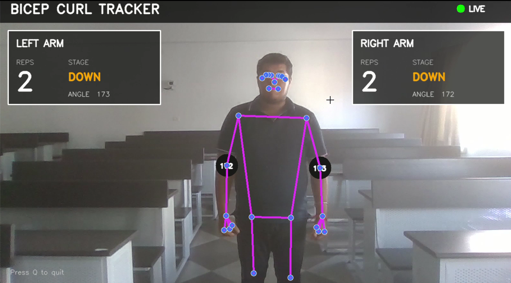

# 💪 Real-Time Gym Tracker & Bicep Curl Counter

A real-time **computer vision-based fitness tracker** that uses **MediaPipe Pose** and **OpenCV** to detect body landmarks, calculate elbow joint angles, and automatically count bicep curls from a webcam feed.

The system tracks both arms independently and provides real-time information about the number of repetitions, current movement stage, and elbow angle.

---

## 🎥 Project Demo

<p align="center">
  <a href="[YOUR_GOOGLE_DRIVE_LINK](https://drive.google.com/file/d/1WWdr5MhFv4NbTVFKwOnkh4TqIh7vRwfz/view?usp=drive_link)">
    
  </a>
</p>

<p align="center">
  🎥 <b><a href="[YOUR_GOOGLE_DRIVE_LINK](https://drive.google.com/file/d/1WWdr5MhFv4NbTVFKwOnkh4TqIh7vRwfz/view?usp=drive_link)">Watch the Full Video Demo</a></b>
</p>

## 🚀 Features

* 🧍 Real-time human pose estimation
* 📷 Webcam-based exercise tracking
* 🦾 Independent left and right arm tracking
* 📐 Elbow angle calculation
* 🔢 Automatic bicep curl repetition counting
* ⬆️⬇️ `UP` / `DOWN` movement detection
* 📊 Real-time workout dashboard
* 🎯 Visual pose landmark tracking
* ⚡ Real-time video processing

---

## 🛠️ Tech Stack

* **Python**
* **OpenCV**
* **MediaPipe**
* **NumPy**

---

## 🧠 How It Works

The application follows a simple computer vision pipeline:

```text
              Webcam
                 │
                 ▼
        OpenCV Video Capture
                 │
                 ▼
       MediaPipe Pose Model
                 │
                 ▼
         Body Landmarks
                 │
        ┌────────┴────────┐
        ▼                 ▼
   Left Arm           Right Arm
 Shoulder-Elbow       Shoulder-Elbow
    -Wrist               -Wrist
        │                 │
        ▼                 ▼
   Elbow Angle        Elbow Angle
        │                 │
        ▼                 ▼
   UP / DOWN          UP / DOWN
        │                 │
        ▼                 ▼
   Rep Counter        Rep Counter
        │                 │
        └────────┬────────┘
                 ▼
        Real-Time Dashboard
```

### 1. Pose Detection

MediaPipe Pose processes each webcam frame and detects human body landmarks.

The project primarily uses:

* Left Shoulder
* Left Elbow
* Left Wrist
* Right Shoulder
* Right Elbow
* Right Wrist

These landmarks provide the coordinates required to analyze arm movement.

### 2. Elbow Angle Calculation

The angle at the elbow is calculated using the shoulder, elbow, and wrist coordinates.

```text
Shoulder
    \
     \
     Elbow
       \
        \
       Wrist
```

The calculated angle is used to determine whether the arm is extended or curled.

### 3. Movement Detection

The system uses angle thresholds to identify the two stages of a bicep curl:

| Elbow Angle | Stage |
| ----------: | ----- |
|    `> 160°` | DOWN  |
|     `< 30°` | UP    |

A repetition is counted when the arm moves from:

```text
DOWN → UP
```

The arm must return to the `DOWN` position before another repetition can be registered.

This state-based approach helps prevent multiple counts while the arm remains in the curled position.

---

## 📊 Real-Time Dashboard

The video feed displays:

* Left arm repetition count
* Right arm repetition count
* Current stage
* Elbow angle
* Pose landmarks
* Live workout status

Example:

```text
┌──────────────────────────────────────────────┐
│             BICEP CURL TRACKER               │
│                                      ● LIVE  │
│                                              │
│  ┌────────────────┐    ┌────────────────┐   │
│  │ LEFT ARM       │    │ RIGHT ARM      │   │
│  │                │    │                │   │
│  │ REPS     STAGE │    │ REPS     STAGE │   │
│  │  12       UP   │    │  11      DOWN  │   │
│  │                │    │                │   │
│  │ ANGLE    27°   │    │ ANGLE   168°   │   │
│  └────────────────┘    └────────────────┘   │
│                                              │
│              Pose Detection                  │
└──────────────────────────────────────────────┘
```

---

## 📁 Project Structure

```text
gym-tracker/
│
├── Gym_Tracker.ipynb
├── requirements.txt
└── README.md
```

---

## ⚙️ Installation

### 1. Clone the repository

```bash
git clone https://github.com/your-username/gym-tracker.git
cd gym-tracker
```

### 2. Create a virtual environment

```bash
python -m venv venv
```

Activate it on Windows:

```bash
venv\Scripts\activate
```

### 3. Install dependencies

```bash
pip install -r requirements.txt
```

---

## ▶️ Running the Project

Open the Jupyter Notebook:

```bash
jupyter notebook
```

Then open:

```text
Gym_Tracker.ipynb
```

Run the cells sequentially.

Make sure a webcam is connected and accessible by the system.

Press:

```text
Q
```

to exit the video feed.

---

## 🎯 Current Limitations

The current implementation focuses specifically on bicep curls and uses fixed elbow-angle thresholds.

Potential sources of variation include:

* Camera positioning
* Body orientation
* Lighting conditions
* Partial visibility of body landmarks
* Occlusion
* Individual differences in exercise technique

---

## 🔮 Future Improvements

The project can be extended into a more complete AI-powered fitness assistant.

### Exercise Recognition

Support additional exercises such as:

* Squats
* Push-ups
* Shoulder presses
* Lunges
* Dumbbell rows

### Form Analysis

Add automatic feedback such as:

```text
GOOD FORM
KEEP YOUR ELBOW STABLE
FULL RANGE OF MOTION
```

### Workout Analytics

Track:

* Total repetitions
* Sets
* Workout duration
* Exercise history
* Progress over time

### Advanced Features

* Exercise classification
* Rep quality scoring
* Voice feedback
* Calorie estimation
* User-specific thresholds
* Workout history dashboard
* Web/mobile interface

---

## 📌 Key Concepts Demonstrated

This project demonstrates practical implementation of:

**Computer Vision · Pose Estimation · MediaPipe · OpenCV · NumPy · Real-Time Video Processing · Human Pose Landmarks · Joint Angle Calculation · State-Based Rep Counting**

---

## 👨‍💻 Project

Built as a computer vision project to explore real-time human pose estimation and exercise tracking using a standard webcam.

---
